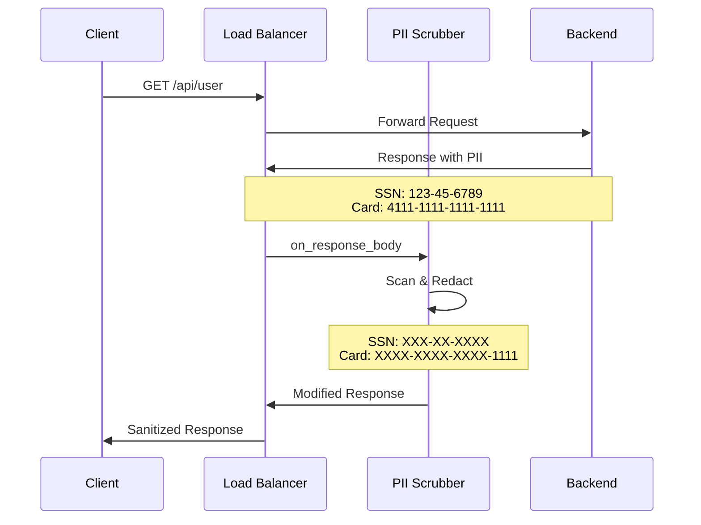

# Demo 1: Edge Security - PII Scrubbing

A proxy-wasm plugin that scans HTTP response bodies for PII (Personally Identifiable Information) patterns and redacts them before the response reaches the client.

## Quick Start

```bash
# Build and test (default)
make all

# Full workflow: build, test, deploy, and verify
make full

# Or step by step:
make build      # Build the Wasm plugin
make test       # Run tests
make deploy     # Deploy to Cloud Run
make test-live  # Verify PII scrubbing works
```

## Available Make Targets

| Target | Description |
|--------|-------------|
| `make all` | Build and run tests (default) |
| `make full` | Complete workflow: build, test, deploy, test-live |
| `make build` | Build the Wasm plugin |
| `make test` | Run Rust unit tests |
| `make test-verbose` | Run tests with detailed output |
| `make deploy` | Deploy to Cloud Run via Cloud Build |
| `make deploy-skip-build` | Redeploy without rebuilding |
| `make test-live` | Test deployed service with latency comparison |
| `make destroy` | Clean up all GCP resources |
| `make lint` | Run clippy linter |
| `make fmt` | Format code |
| `make clean` | Clean build artifacts |

## What It Does

This plugin intercepts HTTP responses at the Load Balancer level and:

1. **Scans** response bodies for PII patterns
2. **Redacts** sensitive data using pattern-specific replacements
3. **Adds headers** indicating redaction occurred



## Supported PII Patterns

| Pattern | Example Input | Redacted Output | Enabled by Default |
|---------|---------------|-----------------|-------------------|
| Credit Card | `4111-1111-1111-1111` | `XXXX-XXXX-XXXX-1111` | ✅ |
| Credit Card (no dash) | `4111111111111111` | `XXXXXXXXXXXX1111` | ✅ |
| SSN | `123-45-6789` | `XXX-XX-XXXX` | ✅ |
| Email | `user@example.com` | `[EMAIL REDACTED]` | ✅ |
| US Phone | `555-123-4567` | `(XXX) XXX-4567` | ❌ |

## Prerequisites

- Rust 1.75+
- wasm32-unknown-unknown target: `rustup target add wasm32-unknown-unknown`

## Building

```bash
# Standard build
cargo build --target wasm32-unknown-unknown --release

# Or use make
make build
```

Output: `target/wasm32-unknown-unknown/release/edge_security.wasm`

## Configuration

The plugin accepts JSON configuration through Envoy:

```json
{
  "log_level": "info",
  "patterns": {
    "credit_card": true,
    "ssn": true,
    "email": true,
    "phone_us": false
  },
  "bypass_paths": ["/health", "/metrics"],
  "max_body_size_bytes": 1048576
}
```

### Configuration Options

| Option | Type | Default | Description |
|--------|------|---------|-------------|
| `log_level` | string | `"info"` | Log level: trace, debug, info, warn, error |
| `patterns.credit_card` | bool | `true` | Enable credit card detection |
| `patterns.ssn` | bool | `true` | Enable SSN detection |
| `patterns.email` | bool | `true` | Enable email detection |
| `patterns.phone_us` | bool | `false` | Enable US phone detection |
| `bypass_paths` | string[] | `["/health", "/metrics"]` | Paths to skip |
| `max_body_size_bytes` | int | `1048576` | Max body size to scan (1MB) |

## Response Headers

The plugin adds headers to indicate WASM processing:

| Header | Description | Example |
|--------|-------------|---------|
| `X-WASM-Active` | Indicates WASM filter is running | `true` |
| `X-WASM-Scrub` | Scrubbing status for this request | `will-scrub`, `bypassed`, `non-text`, `too-large` |

## Testing

### Unit Tests

```bash
# Run all tests
make test

# Run with verbose output
make test-verbose

# Run specific test
cargo test test_credit_card_redaction
```

### Testing Deployed Cloud Run Service

```bash
# Run all live tests with authentication and latency comparison
make test-live
```

**Expected output from `make test-live`:**

```
==========================================
1. CLOUD RUN DIRECT (no WASM filter)
==========================================
Service URL: https://demo1-edge-security-backend-xxxxx-uc.a.run.app

Health check:
{
  "demo": "01-edge-security",
  "status": "healthy",
  "uptime_seconds": 0,
  "version": "1.0.0"
}

User endpoint (PII NOT scrubbed - direct to backend):
{
  "created_at": "2024-01-15T10:30:00Z",
  "email": "john.doe@example.com",
  "id": "user-12345",
  "name": "John Doe",
  "payment": {
    "billing_address": {
      "city": "Anytown",
      "state": "CA",
      "street": "123 Main St",
      "zip": "12345"
    },
    "card_number": "4111-1111-1111-1111",
    "expiry": "12/25"
  },
  "phone": "555-123-4567",
  "ssn": "123-45-6789"
}

⏱️  Direct latency: 0.089s

==========================================
2. LOAD BALANCER (with WASM filter)
==========================================
Load Balancer IP: 34.102.166.166

Health check (via LB):
{
  "demo": "01-edge-security",
  "status": "healthy",
  "uptime_seconds": 2,
  "version": "1.0.0"
}

User endpoint (PII SHOULD be scrubbed by WASM):
{
  "created_at": "2024-01-15T10:30:00Z",
  "email": "[EMAIL REDACTED]",
  "id": "user-12345",
  "name": "John Doe",
  "payment": {
    "billing_address": {
      "city": "Anytown",
      "state": "CA",
      "street": "123 Main St",
      "zip": "12345"
    },
    "card_number": "XXXX-XXXX-XXXX-1111",
    "expiry": "12/25"
  },
  "phone": "555-123-4567",
  "ssn": "XXX-XX-XXXX"
}

⏱️  LB + WASM latency: 0.156s

Response headers (WASM indicator):
x-wasm-scrub: will-scrub
x-wasm-active: true
```

### Manual Testing

```bash
# Direct to Cloud Run (no WASM)
curl -H "Authorization: Bearer $(gcloud auth print-identity-token)" \
  https://YOUR-SERVICE-URL.run.app/api/user

# Via Load Balancer (with WASM PII scrubbing)
curl -k https://YOUR-LB-IP/api/user
```

### Test Fixtures

See [DATA_STRUCTURES.md](../DATA_STRUCTURES.md#demo-1-pii-test-cases) for comprehensive test cases.

## Project Structure

```
01-edge-security/
├── Cargo.toml              # Rust package configuration
├── Makefile                # Build automation
├── README.md               # This file
├── cloudbuild.yaml         # Cloud Build configuration
├── src/
│   ├── lib.rs              # Main plugin implementation
│   └── patterns.rs         # PII pattern definitions
├── scripts/
│   ├── deploy.sh           # Deployment script
│   ├── 99-remove.sh        # Cleanup script
│   ├── setup-dev.sh        # Development setup
│   └── test.sh             # Test runner
└── infrastructure/
    ├── backend/            # Python Flask backend
    ├── docker/             # Docker compose for local testing
    ├── envoy/              # Envoy configuration
    └── gcp/                # GCP Load Balancer config
```

## Architecture

### Plugin Lifecycle

1. **Initialization** (`on_configure`)
   - Load JSON configuration
   - Set log level
   - Initialize pattern matchers

2. **Request Headers** (`on_http_request_headers`)
   - Capture request path
   - Check bypass paths

3. **Response Headers** (`on_http_response_headers`)
   - Check content type (only process text/json)
   - Check content length against max size

4. **Response Body** (`on_http_response_body`)
   - Buffer body chunks
   - On end of stream: scan and redact
   - Add X-PII-Redacted headers
   - Replace response body

### Performance Considerations

- **Pure Rust string matching** - No external regex libraries (GCP Service Extensions compatible)
- **Minimal WASM size** - ~230KB compiled binary
- **Sub-100ms overhead** - WASM processing adds minimal latency
- Body is buffered only when needed for modification
- Large bodies (>1MB) skip processing
- Binary content types are ignored

## Troubleshooting

### Wasm Won't Load

```bash
# Check file exists
ls -la target/wasm32-unknown-unknown/release/edge_security.wasm

# Verify it's a valid Wasm file
file target/wasm32-unknown-unknown/release/edge_security.wasm

# Check Envoy logs
docker logs envoy-demo1 2>&1 | grep -i wasm
```

### Redaction Not Working

1. Check content type is `application/json` or `text/*`
2. Verify body size is under 1MB
3. Check bypass paths don't match
4. Check GCP logs for WASM errors:
   ```bash
   gcloud logging read 'resource.type="networkservices.googleapis.com/WasmPluginVersion"' \
     --limit=20 --format='table(timestamp,severity,jsonPayload.message)'
   ```
5. Enable debug logging:
   ```json
   {"log_level": "debug"}
   ```

### Common GCP Service Extensions Issues

| Error | Cause | Solution |
|-------|-------|----------|
| `TerminationException` | Incompatible library (e.g., `regex` crate) | Use pure Rust string matching |
| `unexpected status: 2` | Adding headers in `on_http_response_body` | Move header additions to `on_http_response_headers` |
| `Callback timeout` | WASM execution too slow | Optimize patterns, reduce body size limit |

## Deployment

### Prerequisites

- GCP project with billing enabled
- `gcloud` CLI authenticated (`gcloud auth login`)
- Cloud Build API enabled
- Artifact Registry API enabled

### Deploy to Cloud Run

```bash
# Full deploy (builds Wasm + backend, deploys to Cloud Run)
make deploy

# Outputs show all gcloud commands being executed
```

The deployment script will:
1. Build the Rust Wasm plugin using Cloud Build
2. Build the Python backend container
3. Push to Artifact Registry
4. Deploy to Cloud Run
5. Upload Wasm file to GCS

### Cleanup

```bash
# Destroy all GCP resources for this demo
make destroy
```

This removes:
- Cloud Run service
- Container images from Artifact Registry
- Wasm files from GCS
- Service Extensions (if configured)

## Notes

- **Organization Policy**: If your GCP org blocks `allUsers` access, use authenticated requests via `make test-live`
- **Wasm at Edge**: The Wasm filter runs in the Load Balancer, not Cloud Run directly. See `infrastructure/gcp/` for Load Balancer configuration.
- **GCP Service Extensions Limitations**: The `regex` crate is NOT compatible with GCP Service Extensions WASM runtime. This plugin uses pure Rust string matching instead.

## Related Documentation

### Project Documentation
- [Project Overview](../PROJECT_OVERVIEW.md)
- [Code Principles](../CODE_PRINCIPLES.md)
- [Data Structures](../DATA_STRUCTURES.md)
- [Contributing](../CONTRIBUTING.md)

### GCP Service Extensions Documentation
- [Service Extensions Overview](https://cloud.google.com/service-extensions/docs/overview)
- [Prepare Plugin Code (Rust)](https://cloud.google.com/service-extensions/docs/prepare-plugin-code#rust)
- [Create a Plugin](https://cloud.google.com/service-extensions/docs/create-plugin)
- [Plugin Limitations](https://cloud.google.com/service-extensions/docs/plugins-overview#limitations)
- [proxy-wasm Rust SDK](https://github.com/proxy-wasm/proxy-wasm-rust-sdk)

## License

See repository root for license information.