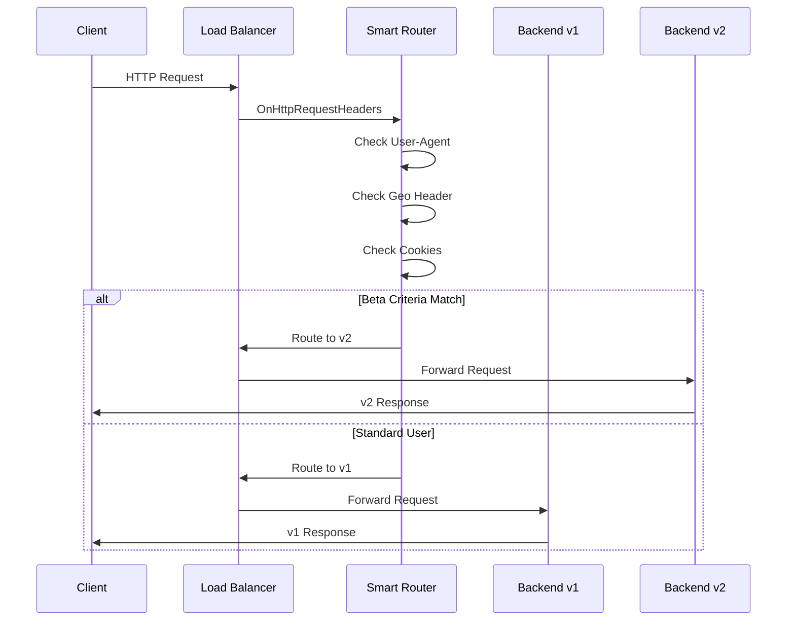

# Demo 2: Smart Router - A/B Testing & Canary Deployments

A proxy-wasm plugin that inspects HTTP request headers and cookies to make intelligent routing decisions for A/B testing and canary deployments.

## Quick Start

```bash
# Complete workflow: build, test, deploy, and verify (default)
make all

# Quick build and test only (no deployment)
make quick

# Or step by step:
make build      # Build the Wasm plugin and container
make test       # Run tests
make deploy     # Deploy to Cloud Run
make test-live  # Verify routing works
```

## Available Make Targets

| Target | Description |
|--------|-------------|
| `make all` | Build, test, and deploy (default) |
| `make full` | Complete workflow: build, test, deploy, test-live |
| `make build` | Build Wasm plugin (Rust) and container (Cloud Build) |
| `make build-wasm` | Build only the Wasm plugin |
| `make build-container` | Build only the container image |
| `make test` | Run Rust unit tests |
| `make test-cover` | Run tests with coverage |
| `make deploy` | Deploy to Cloud Run |
| `make test-live` | Test deployed service with authentication |
| `make destroy` | Clean up all GCP resources |
| `make lint` | Run clippy linter |
| `make fmt` | Format code |
| `make clean` | Clean build artifacts |

## What It Does

This plugin intercepts HTTP requests at the Load Balancer level and:

1. **Inspects** request headers, cookies, and query parameters
2. **Evaluates** routing rules in priority order
3. **Routes** traffic to different backend versions
4. **Adds** attribution headers for debugging



## Routing Criteria

### Default Beta Tester Rules

All conditions must match:

| Condition | Header/Cookie | Value |
|-----------|---------------|-------|
| Device | `User-Agent` | Contains "iPhone" |
| Location | `X-Geo-Country` | Equals "DE" |
| Beta Flag | `Cookie: beta-tester` | Equals "true" |

### Canary Deployment

| Condition | Header | Value |
|-----------|--------|-------|
| Hash-based | `X-Request-Hash` | Single digit (0-9) = 10% traffic |

## Prerequisites

- Rust 1.70+ with wasm32-unknown-unknown target: [rustup.rs](https://rustup.rs/)
  - Install: `curl --proto '=https' --tlsv1.2 -sSf https://sh.rustup.rs | sh`
  - Add target: `rustup target add wasm32-unknown-unknown`
- GCP project with billing enabled (for deployment)

## Building

```bash
# Build with Cargo
cargo build --target wasm32-unknown-unknown --release

# Or use make
make build-wasm
```

Output: `target/wasm32-unknown-unknown/release/smart_router.wasm`

### ⚠️ GCP Service Extensions Sandbox Requirements

**CRITICAL**: GCP Service Extensions has strict WASM runtime restrictions. WASM must be built for the wasm32-unknown-unknown target without syscalls that are blocked in the sandbox.

```bash
# ✅ CORRECT for GCP Service Extensions
cargo build --target wasm32-unknown-unknown --release

# ❌ WRONG - WASI target (includes unwanted imports)
cargo build --target wasm32-wasi --release
```

**Common Errors and Solutions:**

1. **`Failed to load Wasm module due to a missing import`**
   - **Cause**: Dependency on Rust std library functions that use syscalls not available in GCP's sandbox
   - **Fix**: Use minimal dependencies and proxy-wasm SDK only
   - **Verify**: Check for imported functions with `wasm-objdump -x smart_router.wasm | grep import`

**GCP Service Extensions Sandbox Restrictions:**
- ❌ No standard library functions requiring OS syscalls
- ❌ No filesystem, network, or threading APIs
- ❌ Complex data structures that may allocate unexpectedly
- ✅ Only proxy-wasm SDK APIs and minimal computation

**References:**
- [GCP Service Extensions Plugin Limitations](https://cloud.google.com/service-extensions/docs/plugins-overview#limitations)
- [Prepare Plugin Code (Rust)](https://cloud.google.com/service-extensions/docs/prepare-plugin-code#rust)
- [Rust WebAssembly book](https://rustwasm.github.io/docs/book/)

## Configuration

The plugin accepts JSON configuration through Envoy:

```json
{
  "log_level": "info",
  "default_target": "v1",
  "rules": [
    {
      "name": "beta-testers",
      "priority": 1,
      "conditions": [
        {"type": "header", "key": "User-Agent", "operator": "contains", "value": "iPhone"},
        {"type": "header", "key": "X-Geo-Country", "operator": "equals", "value": "DE"},
        {"type": "cookie", "key": "beta-tester", "operator": "equals", "value": "true"}
      ],
      "target": "v2",
      "add_headers": {
        "X-Routed-By": "smart-router",
        "X-Route-Reason": "beta-tester-match"
      }
    },
    {
      "name": "canary-10-percent",
      "priority": 2,
      "conditions": [
        {"type": "header", "key": "X-Request-Hash", "operator": "regex", "value": "^[0-9]$"}
      ],
      "target": "v2"
    }
  ]
}
```

### Configuration Options

| Option | Type | Default | Description |
|--------|------|---------|-------------|
| `log_level` | string | `"info"` | Log level: trace, debug, info, warn, error |
| `default_target` | string | `"v1"` | Default backend when no rules match |
| `rules` | array | `[]` | Routing rules in priority order |

### Routing Rule Schema

| Field | Type | Description |
|-------|------|-------------|
| `name` | string | Human-readable rule name |
| `priority` | int | Evaluation order (lower = first) |
| `conditions` | array | Conditions that must ALL match |
| `target` | string | Backend to route to |
| `add_headers` | object | Headers to add to request |
| `remove_headers` | array | Headers to remove from request |

### Condition Types

| Type | Key | Description |
|------|-----|-------------|
| `header` | Header name | Check request header |
| `cookie` | Cookie name | Check cookie value |
| `path` | (ignored) | Check request path |
| `query` | Param name | Check query parameter |

### Operators

| Operator | Description |
|----------|-------------|
| `equals` | Exact match |
| `contains` | Substring match |
| `prefix` | Starts with |
| `suffix` | Ends with |
| `regex` | Regular expression match |
| `exists` | Header/cookie exists |

## Request Headers Added

| Header | Description | Example |
|--------|-------------|---------|
| `X-Routed-By` | Attribution header | `smart-router` |
| `X-Route-Reason` | Why this route was chosen | `beta-tester-match` |

## Response Headers Added

| Header | Description | Example |
|--------|-------------|---------|
| `X-Smart-Router` | Indicates router is active | `active` |

## Testing

### Unit Tests

```bash
# Run all tests
make test

# Run with coverage
make test-cover

# Run specific test
cargo test -- --test determine_route
```

### Testing Deployed Cloud Run Service

```bash
# Run all live tests with authentication
make test-live
```

**Expected output from `make test-live`:**

```
==========================================
LOAD BALANCER with WASM Smart Router
==========================================
Load Balancer IP: 34.49.246.250

1. Health check:
{
  "demo": "02-smart-router",
  "status": "healthy",
  "uptime_seconds": 57,
  "version": "1.0.0"
}

2. Version endpoint (standard user -> v1):
{
  "build": "2024.01.15.001",
  "environment": "production",
  "features": {
    "beta_analytics": false,
    "new_dashboard": false
  },
  "routing_info": {
    "route_reason": "default",
    "routed_by": "smart-router"
  },
  "version": "v1"
}

3. Version endpoint (beta user -> v2):
{
  "build": "2024.01.20.042",
  "environment": "beta",
  "features": {
    "beta_analytics": true,
    "experimental_ai": true,
    "new_dashboard": true
  },
  "routing_info": {
    "route_reason": "beta-tester-match",
    "routed_by": "smart-router"
  },
  "version": "v2-beta"
}

4. Response headers (WASM routing):
x-routed-by: smart-router
x-route-reason: beta-tester-match
```

### Manual Testing

```bash
# Direct to Cloud Run (no WASM)
curl -H "Authorization: Bearer $(gcloud auth print-identity-token)" \
  https://YOUR-SERVICE-URL.run.app/api/version

# Via Load Balancer (with WASM routing)
curl -k https://YOUR-LB-IP/api/version

# Beta user via Load Balancer
curl -k \
  -H "User-Agent: iPhone" \
  -H "X-Geo-Country: DE" \
  -H "Cookie: beta-tester=true" \
  https://YOUR-LB-IP/api/version

# Canary user via Load Balancer
curl -k \
  -H "X-Request-Hash: 5" \
  https://YOUR-LB-IP/api/version
```

### Test Fixtures

See [DATA_STRUCTURES.md](../DATA_STRUCTURES.md#demo-2-routing-test-cases) for comprehensive test cases.

## Project Structure

```
02-smart-router/
├── Cargo.toml          # Rust dependencies
├── Makefile            # Build automation
├── README.md           # This file
├── src/
│   └── lib.rs          # Main plugin implementation
├── target/wasm32-unknown-unknown/release/
│   └── smart_router.wasm   # Built Wasm file
└── infrastructure/
    ├── backend/        # Cloud Run backend
    ├── docker/         # Docker configurations
    ├── envoy/          # Envoy configurations
    └── gcp/            # GCP deployment configs
```

## Architecture

### Plugin Lifecycle

1. **Root Context** (`SmartRouterRoot`)
   - Loads configuration on startup
   - Creates HTTP contexts for requests

2. **HTTP Context** (`SmartRouterHttp`)
   - Processes each request
   - Evaluates routing rules
   - Sets routing headers

### Rule Evaluation

1. Rules are sorted by priority (lower = first)
2. Each rule's conditions are evaluated with AND logic
3. First matching rule determines the target
4. If no rules match, default target is used

### Performance Considerations

- Rules are sorted once at startup
- Cookie parsing is lazy (only when needed)
- Regex patterns are compiled on demand
- Minimal memory allocation per request

## Why Rust Over Go for Wasm at the Edge

In the context of server-side WebAssembly (Wasm) at the edge, **Rust is generally faster than Go**. This stems from Rust's zero-cost abstractions, lack of garbage collection (GC), and more mature Wasm compilation via LLVM, which produce smaller, more efficient binaries. Go's Wasm support, while functional, includes a full runtime (GC and scheduler), leading to larger binaries (often 2-10x bigger) and higher overhead.

### Performance Comparison

- **Startup time**: Go is slower due to runtime initialization
- **Execution speed**: Rust edges out by 20-50% on average for CPU-bound tasks, but can be 5-10x faster in GC-heavy scenarios
- **Memory usage**: Rust uses 30-70% less memory, reducing edge resource costs
- **Binary size**: Rust Wasm modules are ~100-500 KB; Go's are 1-10 MB

### Why Rust is Faster in Wasm Edge Scenarios

1. **No GC Overhead**: Go's GC introduces pauses and allocations, amplified in Wasm's sandboxed environment
2. **Binary Size & Cold Starts**: Rust's smaller binaries lead to faster edge deploys and instantiation
3. **Runtime Compatibility**: Edge platforms optimize better for Rust-native Wasm
4. **Edge-Specific Gains**: In latency-sensitive edge computing, Rust reduces TTFB by 20-40%

**For load balancer extensions, Rust is the recommended choice for performance-critical logic.**

## Deployment

### Prerequisites

- GCP project with billing enabled
- `gcloud` CLI authenticated (`gcloud auth login`)
- Cloud Build API enabled
- Artifact Registry API enabled

### Deploy to Cloud Run

```bash
# Full deploy (builds Wasm + backend, deploys to Cloud Run)
make deploy

# Outputs show all gcloud commands being executed
```

The deployment script will:
1. Build the Rust Wasm plugin (via Cloud Build)
2. Build the Python backend container
3. Push to Artifact Registry
4. Deploy to Cloud Run
5. Deploy Load Balancer with WASM plugin
6. Upload Wasm file to GCS

### Cleanup

```bash
# Destroy all GCP resources for this demo
make destroy
```

This removes:
- Cloud Run service
- Container images from Artifact Registry
- Wasm files from GCS
- Load Balancer resources
- Service Extensions

## Troubleshooting

### Rust Build Fails

```bash
# Verify Rust is installed
rustc --version
cargo --version

# Verify wasm32-unknown-unknown target is installed
rustup target list --installed | grep wasm32-unknown-unknown

# If not installed
rustup target add wasm32-unknown-unknown
```

### Wasm Won't Load

```bash
# Check file exists
ls -la smart_router.wasm

# Verify it's a valid Wasm file
file smart_router.wasm

# Check GCP logs for WASM errors:
gcloud logging read 'resource.type="networkservices.googleapis.com/WasmPluginVersion"' \
  --limit=20 --format='table(timestamp,severity,jsonPayload.message)'
```

### Routing Not Working

1. Check all conditions are met (AND logic)
2. Verify header names are correct (case-sensitive in Envoy)
3. Check GCP logs for WASM errors
4. Enable debug logging: `{"log_level": "debug"}`

### Cookie Not Detected

1. Verify cookie format: `name=value`
2. Check for URL encoding issues
3. Test with debug endpoint:
   ```bash
   curl -H "Cookie: beta-tester=true" http://localhost:10000/debug/headers
   ```

### WASM Plugin Crashes on Startup

#### Error: "Failed to load Wasm module due to a missing import"

**Symptom**: Plugin fails to start in GCP Service Extensions with error about missing imports

**Root Cause**: WASM was built with dependencies that use syscalls not available in GCP's sandbox

**Solution**: 
- Use only proxy-wasm SDK APIs
- Avoid standard library functions requiring OS syscalls
- Keep dependencies minimal

**Check Logs**:
```bash
# View Service Extensions logs
gcloud logging read 'resource.type="networkservices.googleapis.com/WasmPluginVersion"' \
  --limit=20 --format='table(timestamp,severity,jsonPayload.message)'

# Filter for errors only
gcloud logging read 'resource.type="networkservices.googleapis.com/WasmPluginVersion" AND severity>=ERROR' \
  --limit=10
```

### Authentication Errors (403 Forbidden)

If your GCP organization blocks `allUsers` access:

```bash
# Use authenticated requests
curl -H "Authorization: Bearer $(gcloud auth print-identity-token)" \
  https://YOUR-SERVICE-URL.run.app/api/version
```

**Note**: The deployment script automatically uses `--no-invoker-iam-check` with `--ingress=internal-and-cloud-load-balancing` to allow Load Balancer traffic while restricting direct access.

## Notes

- **Organization Policy**: If your GCP org blocks `allUsers` access, use authenticated requests via `make test-live`
- **Wasm at Edge**: The Wasm filter runs in the Load Balancer, not Cloud Run directly. See `infrastructure/gcp/` for Load Balancer configuration.
- **Rust Recommended**: Rust provides better performance for Wasm at the edge compared to Go/TinyGo

## Related Documentation

### Project Documentation
- [Project Overview](../PROJECT_OVERVIEW.md)
- [Code Principles](../CODE_PRINCIPLES.md)
- [Data Structures](../DATA_STRUCTURES.md)
- [Contributing](../CONTRIBUTING.md)

### GCP Service Extensions Documentation
- [Service Extensions Overview](https://cloud.google.com/service-extensions/docs/overview)
- [Prepare Plugin Code (Rust)](https://cloud.google.com/service-extensions/docs/prepare-plugin-code#rust)
- [Create a Plugin](https://cloud.google.com/service-extensions/docs/create-plugin)
- [Plugin Limitations](https://cloud.google.com/service-extensions/docs/plugins-overview#limitations)
- [proxy-wasm Rust SDK](https://github.com/proxy-wasm/proxy-wasm-rust-sdk)

## License

See repository root for license information.
