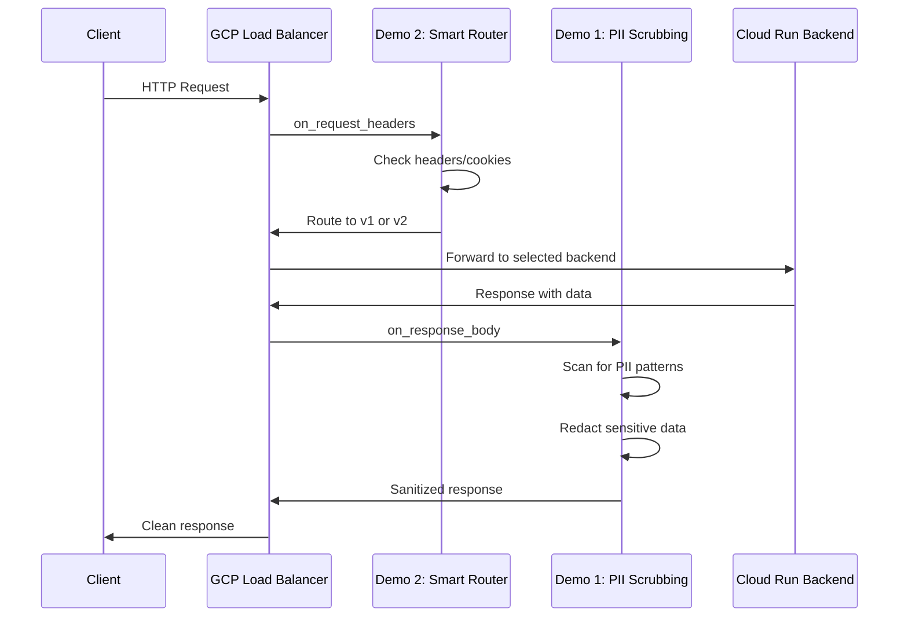
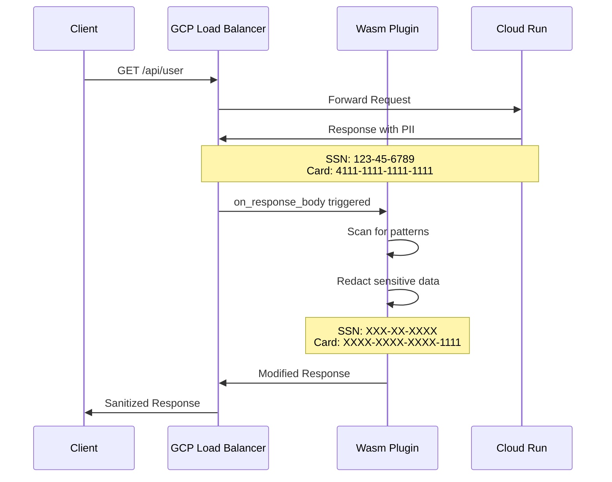
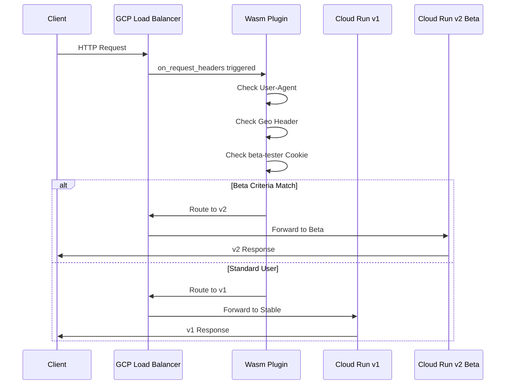

# PROJECT_OVERVIEW.md - GCP WASM Service Extensions Demos

## Executive Summary

This monorepo contains **two demonstration projects** showcasing WebAssembly (Wasm) use cases with **GCP Service Extensions**. Both demos run Wasm plugins inside the Google Cloud Application Load Balancer, with Cloud Run as the backend service.

---

## Demo Overview

| Demo | Name | Use Case | Language | Location |
|------|------|----------|----------|----------|
| 1 | **Edge Security** | PII/PCI Data Scrubbing | Rust + proxy-wasm | Load Balancer (Response Path) |
| 2 | **Smart Router** | A/B Testing & Canary | TinyGo + proxy-wasm | Load Balancer (Request Path) |

Both demos share a **Cloud Run backend** that serves as the origin for API requests.

---

## Architecture Diagram



---

## Demo 1: Edge Security (PII Scrubbing)

### Purpose
Scrub sensitive data from API responses before they reach the client. This ensures PII/PCI compliance even if backend services accidentally expose sensitive information.

### Flow



### Extension Point
- **Location**: Response Path
- **Callback**: `on_http_response_body`
- **Action**: Regex-based PII detection and redaction

### Patterns Detected
| Type | Pattern | Replacement |
|------|---------|-------------|
| Credit Card | `\d{4}-\d{4}-\d{4}-\d{4}` | `XXXX-XXXX-XXXX-$4` |
| SSN | `\d{3}-\d{2}-\d{4}` | `XXX-XX-XXXX` |
| Email | Standard email regex | `[EMAIL REDACTED]` |

---

## Demo 2: Smart Router (A/B Testing)

### Purpose
Route incoming requests to different backend versions based on user attributes. This enables A/B testing and canary deployments without modifying backend code.

### Flow



### Extension Point
- **Location**: Request Path
- **Callback**: `on_http_request_headers`
- **Action**: Header inspection and backend selection

### Routing Criteria
| Condition | Header/Cookie | Value |
|-----------|---------------|-------|
| Device | `User-Agent` | Contains "iPhone" |
| Location | `X-Geo-Country` | Equals "DE" |
| Beta Flag | `Cookie: beta-tester` | Equals "true" |

---

## Cloud Run Backend

Both demos share a common Cloud Run backend service that:

1. **For Demo 1**: Returns user data that may contain PII (for testing the scrubbing)
2. **For Demo 2**: Hosts multiple versions (v1 stable, v2 beta) for A/B routing

### Endpoints

| Endpoint | Purpose | Demo |
|----------|---------|------|
| `/api/user` | Returns user with PII data | Demo 1 |
| `/api/user-clean` | Returns user without PII | Demo 1 |
| `/v1/api/version` | Returns v1 stable response | Demo 2 |
| `/v2/api/version` | Returns v2 beta response | Demo 2 |
| `/health` | Health check for LB | Both |

---

## Repository Structure

```
cloudrun-wasm/
├── README.md                          # Quick start guide
├── CODE_PRINCIPLES.md                 # Global coding standards
├── PROJECT_OVERVIEW.md                # This file - Architecture docs
├── CONTRIBUTING.md                    # Developer setup guides
├── DATA_STRUCTURES.md                 # Schemas and examples
├── TODO.md                            # Implementation checklist
│
├── 01-edge-security/                  # Demo 1: PII Scrubbing
│   ├── README.md
│   ├── Cargo.toml
│   ├── src/
│   │   └── lib.rs
│   ├── tests/
│   └── Makefile
│
├── 02-smart-router/                   # Demo 2: A/B Testing
│   ├── README.md
│   ├── go.mod
│   ├── main.go
│   ├── router/
│   │   └── router.go
│   └── Makefile
│
├── infrastructure/
│   ├── envoy/
│   │   ├── envoy.yaml                 # Base Envoy config
│   │   ├── envoy-demo1.yaml           # Demo 1 specific config
│   │   └── envoy-demo2.yaml           # Demo 2 specific config
│   ├── docker/
│   │   └── Dockerfile.envoy           # Envoy with Wasm support
│   └── backend/
│       ├── Dockerfile
│       ├── app.py                     # Flask backend
│       └── README.md
│
└── scripts/
    ├── build-all.sh                   # Build all demos
    ├── test-all.sh                    # Run all tests
    └── setup-dev.sh                   # Development environment setup
```

---

## Technology Stack

### Demo 1 & 2: Proxy-Wasm Plugins

| Component | Technology | Version |
|-----------|------------|---------|
| Language | Rust / TinyGo | Rust 1.75+ / TinyGo 0.30+ |
| SDK | proxy-wasm-rust-sdk / proxy-wasm-go-sdk | Latest |
| ABI | proxy-wasm ABI | v0.2.1 |
| Runtime | Envoy Proxy (local) / GCP LB (prod) | Envoy 1.28+ |
| Container | Docker | 24+ |

### Cloud Run Backend

| Component | Technology | Version |
|-----------|------------|---------|
| Language | Python | 3.11+ |
| Framework | Flask | 3.0+ |
| Container | Docker | 24+ |
| Runtime | Cloud Run | Gen2 |

---

## Proxy-Wasm ABI Reference

The proxy-wasm ABI defines the interface between the host (Envoy/GCP LB) and the plugin.

### Host-Provided Functions

```
get_current_time_nanoseconds() -> u64
get_buffer_bytes(buffer_type, start, max_size) -> bytes
set_buffer_bytes(buffer_type, start, size, value)
get_header_map_value(map_type, key) -> value
replace_header_map_value(map_type, key, value)
add_header_map_value(map_type, key, value)
send_local_response(status, headers, body, grpc_status, details)
```

### Plugin Callbacks

```
on_configure(plugin_configuration_size) -> bool
on_http_request_headers(num_headers, end_of_stream) -> Action
on_http_request_body(body_size, end_of_stream) -> Action
on_http_response_headers(num_headers, end_of_stream) -> Action
on_http_response_body(body_size, end_of_stream) -> Action
```

---

## GCP Deployment

The demos are deployed on Google Cloud Platform using:

1. **Cloud Run** - Hosts the backend services
2. **Application Load Balancer** - Routes traffic and runs Wasm plugins via Service Extensions
3. **Cloud Storage** - Stores Wasm plugin binaries

For local development and testing of Wasm plugins, use the provided Cloud Build configurations to build and deploy to GCP.

---

## Success Criteria

### Demo 1: Edge Security
- [ ] Credit card numbers in responses are redacted
- [ ] SSN patterns are redacted
- [ ] Non-sensitive data passes through unchanged
- [ ] `X-PII-Redacted` header added when scrubbing occurs
- [ ] Latency overhead < 1ms per request

### Demo 2: Smart Router
- [ ] Requests with beta criteria route to v2
- [ ] Standard requests route to v1
- [ ] `X-Routed-By` and `X-Route-Reason` headers added
- [ ] Routing decision logged
- [ ] Latency overhead < 100μs per request

---

## Next Steps

After reviewing this architecture:

1. **Switch to Code mode** to implement the demos
2. Start with infrastructure setup (Docker + Envoy)
3. Implement Cloud Run backend
4. Implement Demo 1 (Rust proxy-wasm)
5. Implement Demo 2 (TinyGo proxy-wasm)
6. Test all demos locally
7. Deploy to GCP